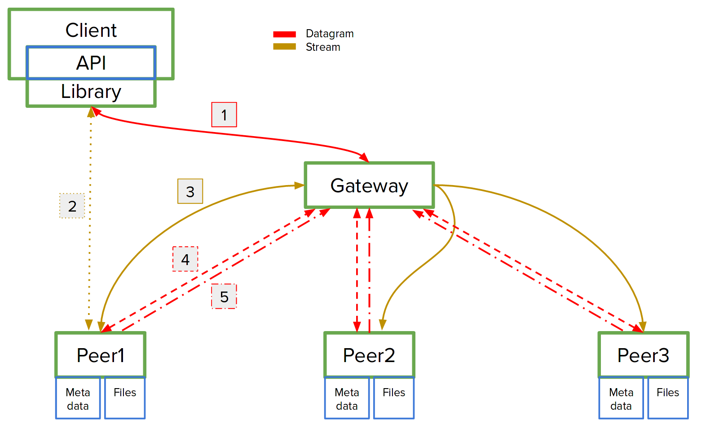

# PSis Project

This is the implemented architcture for the <a href="https://github.com/Mrrvm/PSis/blob/master/Project_statement.pdf" target="_blank">assignment</a>:

  

1 - Client asks gateway for peer address, gateway responds.

2 - Client makes API requests to the system, the system responds.

3 - Gateway redirects requests to all peers.

4 - Gateway pings peer, peer pings back if alive.

5 - New peer sends its address to the gateway.

For better understanding read our <a href="https://github.com/Mrrvm/PSis/blob/master/Project_report.pdf" target="_blank">report</a> (in portuguese).

Compile gateway

	gcc -g -pthread defs.c generic_list.c gateway/* -o [program]

Compile peer

	
	gcc -g -pthread defs.c generic_list.c peers/* -o [program]

Compile cliente

	
	gcc -g client/* -o [program]

Execution order: gateway, peer (...), client (...)

